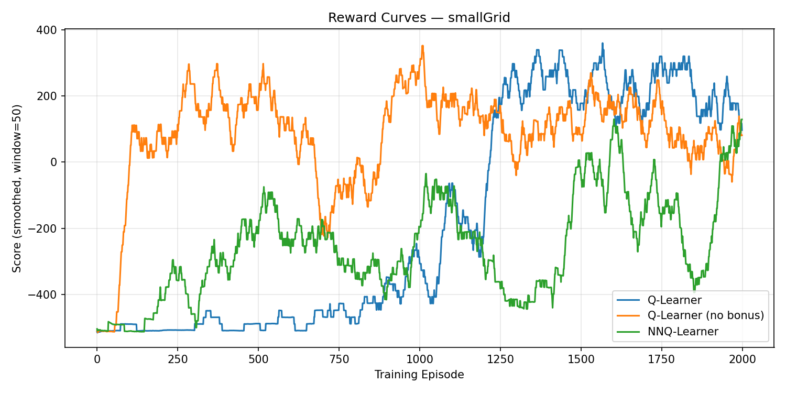
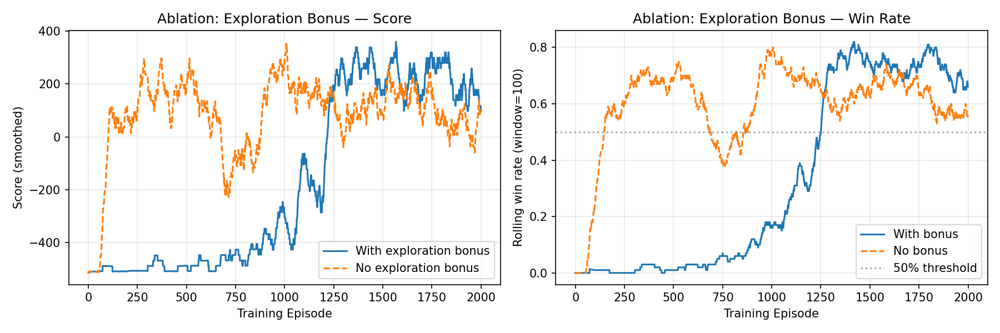

# Pacman Reinforcement Learning Agents

Two reinforcement learning agents built from scratch to play Pacman — a classical tabular Q-learner and a neural network Q-learner — evaluated against random baselines. Built on the [UC Berkeley Pacman AI framework](http://ai.berkeley.edu/reinforcement.html).

Both agents start with zero knowledge of the game and learn purely through trial and error.

## Agents

### QLearnAgent — Tabular Q-Learning

A classical Q-learning agent that maintains a lookup table of state-action values updated via the Bellman equation. The state space is kept tractable through abstraction: the raw game state is compressed to `(Pacman position, ghost positions, capsule locations, food count)`.

Key concepts implemented:

- **Tabular Q-learning** with the Bellman update rule
- **Epsilon-greedy exploration** — random action with probability ε, greedy otherwise
- **Count-based exploration bonus** — unexplored state-action pairs get an optimistic value of 1000.0 until visited `maxAttempts` times, preventing the agent getting stuck in local optima
- **Reward shaping** — terminal win/loss bonuses (+500 / −500) on top of score delta to guide early learning

**Q-learning update (Bellman equation):**

```
Q(s, a) ← Q(s, a) + α [R(s, a, s') + γ · max_a' Q(s', a') − Q(s, a)]
```

**Action selection:**

```
if count(s, a) < maxAttempts:
    value(s, a) = 1000.0   # exploration bonus for under-visited pairs
else:
    value(s, a) = Q(s, a)  # exploit learned values

action = argmax_a value(s, a)   # with ε-greedy random override
```

### NNQAgent — Neural Network Q-Learning

A deep Q-network variant that replaces the lookup table with a small neural network, enabling generalisation across unseen states rather than memorising exact state-action pairs.

Key concepts implemented:

- **Neural Q-network:** 17-feature input → two 64-unit ReLU hidden layers → 5 action outputs (one per direction)
- **Online learning** — transitions are trained on immediately without an experience replay buffer; a deliberate simplification over full DQN, sufficient for the small state space here
- **Target network** — a frozen copy of the main network updated every 50 episodes, decoupling the learning target from the network being trained to stabilise gradients
- **Huber loss** (smooth L1) — robust to the large ±500 terminal reward spikes
- **Linear ε-decay** from 0.3 → 0.05 over training
- **Dense reward shaping** — food-proximity bonus and ghost-proximity penalty, providing a learning signal in early episodes where the agent never wins
- **Gradient clipping** (max norm 1.0)

The 17 input features encode: Pacman position, relative ghost positions and scared status, direction and distance to nearest food, wall indicators in each direction, and food/capsule counts.

## Baselines

Both agents are benchmarked against two non-learning baselines from `sampleAgents.py`:

- **RandomAgent** — picks a random legal action every step
- **RandomishAgent** — repeats its last direction until blocked, then picks randomly; a slightly more coherent policy than pure random

## Results

Tested on `smallGrid` — 2000 training episodes, evaluated over 1000 test games (ε=0, α=0, no further learning).

### QLearnAgent

| Metric | Value |
|---|---|
| Win rate | **908/1000 (90.8%)** |
| Average score | **405.7** |
| Winning score range | 173 – 503 |
| Losing score range | −544 – −508 |

Post-training the agent acts greedily on its frozen Q-table with no further updates.

### NNQAgent

| Metric | Value |
|---|---|
| Win rate | **610/1000 (61.0%)** |
| Average score | **17.8** |
| Winning score range | −1443 – 505 |
| Losing score range | −6357 – −500 |

The wide winning score range reflects path inefficiency — the agent wins, but sometimes after so many steps that the time penalty drives the score negative. This is consistent with the tabular agent reaching wins in ~21 steps on average versus ~70 for NNQAgent.

## Hyperparameters

### QLearnAgent

| Parameter | Default | Role |
|---|---|---|
| `alpha` | 0.2 | Learning rate — how much new experience overwrites old |
| `epsilon` | 0.05 | Exploration rate — probability of taking a random action |
| `gamma` | 0.8 | Discount factor — how much future rewards are valued |
| `maxAttempts` | 30 | Visit threshold before exploration bonus is removed |
| `numTraining` | 10 | Training episodes (set via `-x` flag at runtime) |

### NNQAgent

| Parameter | Default | Role |
|---|---|---|
| `alpha` | 0.001 | Learning rate (Adam optimiser) |
| `epsilon` | 0.3 → 0.05 | Exploration rate — decays linearly over training |
| `gamma` | 0.9 | Discount factor |
| `numTraining` | 10 | Training episodes (set via `-x` flag at runtime) |

After training completes, both `alpha` and `epsilon` are set to 0 so each agent exploits its learned policy with no further updates.

## Setup

Python 3.12. Dependencies: PyTorch, matplotlib, numpy.

```bash
git clone https://github.com/VinethS23/pacman-agents.git
cd pacman-agents
python3 -m venv venv
source venv/bin/activate
pip install -r requirements.txt
```

## Running

```bash
# No graphics — recommended for training runs
python3 pacman.py -p <AGENT> -x 2000 -n 2010 -l smallGrid -q

# With GUI
python3 pacman.py -p <AGENT> -x 2000 -n 2010 -l smallGrid

# Tuning hyperparameters
python3 pacman.py -p <AGENT> -x 2000 -n 2010 -l smallGrid -q \
  -a alpha=0.3,epsilon=0.1,gamma=0.9,maxAttempts=20
```
Replace `<AGENT>` with either `QLearnAgent` or `NNQAgent`

(Note: `maxAttempts` is a QLearnAgent-only parameter and has no effect when running NNQAgent.)

### Flag reference

| Flag | Meaning |
|---|---|
| `-p <Agent>` | Agent class (`QLearnAgent` or `NNQAgent`) |
| `-x 2000` | 2000 training episodes (output suppressed) |
| `-n 2010` | 2010 total episodes → last 10 are test games |
| `-l smallGrid` | Layout (see below) |
| `-q` | No graphics, minimal output |
| `-a alpha=0.3,...` | Override any hyperparameter |

## Available Layouts

| Layout | Description |
|---|---|
| `smallGrid` | Tiny grid, fastest convergence |
| `mediumGrid` | Medium grid |
| `smallClassic` | Small classic Pacman map |
| `mediumClassic` | Standard map |
| `originalClassic` | Full original layout |
| `capsuleClassic` | Includes power capsules |

## Project Structure

```
├── mlLearningAgents.py   # QLearnAgent and NNQAgent implementations
├── evaluate.py           # Evaluation harness — metrics, plots, and results table
├── pacman.py             # Game engine and entry point
├── sampleAgents.py       # RandomAgent and RandomishAgent baselines
└── pacman_utils/
    ├── game.py           # Core game logic, Agent base class
    ├── util.py           # Helpers (Counter, flipCoin, etc.)
    ├── layout.py         # Map loader
    ├── ghostAgents.py    # Ghost AI
    ├── layouts/          # Map files (.lay)
    └── ...
```

## Attribution

The Pacman AI framework was developed at UC Berkeley by John DeNero, Dan Klein, Brad Miller, Nick Hay, and Pieter Abbeel. Adapted for KCL by Simon Parsons; updated to Python 3 by Dylan Cope and Lin Li.

Licensing: free to use or extend for educational purposes — do not distribute solutions, retain attribution, link to [http://ai.berkeley.edu](http://ai.berkeley.edu).

---

## Extended Evaluation

A second agent (`NNQAgent`) and a full evaluation suite (`evaluate.py`) were added to rigorously benchmark both learners against baselines. All results below are from 2000 training episodes followed by 1000 test games (ε=0, no further learning) on `smallGrid`.

### Agent comparison

| Metric | Q-Learner | Q-Learner (no bonus) | NNQ-Learner | RandomishAgent | RandomAgent |
|---|---|---|---|---|---|
| Win rate | **90.8%** | **100%** | 61.0% | 0.0% | 0.1% |
| Avg score | 406 | 472 | 18 | −509 | −509 |
| Avg steps per win | **21** | 48 | 70 | n/a | n/a |
| Episodes to 50% win rate | 1251 | **146** | 1530 | n/a | n/a |
| Score std (last 200 eps) | 474 | 499 | 499 | — | — |
| Q-table unique states | 299 | 294 | — | — | — |
| Avg actions explored/state | 1.96 | 1.96 | — | — | — |

> Score std is high because outcomes are bimodal: wins score ~+500, losses score ~−510. This reflects a decisive policy, not instability.

### Reward curves



### Ablation: count-based exploration bonus



Removing the exploration bonus and using pure ε-greedy produces a counterintuitive result on `smallGrid`:

- Converges to 50% win rate **8.6× faster** (146 vs 1251 episodes)
- Achieves **100% win rate** vs 90.8%
- But wins take **2.3× more steps** (48 vs 21) — the policy is less refined

**Why?** `smallGrid` has a small state space (~300 unique states). The count-based bonus forces the agent to visit every state-action pair 30 times before exploiting its Q-values — significant overhead for a problem this size. Pure ε-greedy finds winning strategies sooner by exploiting partial knowledge earlier, at the cost of a less optimal final policy (longer paths to win).

This illustrates a known trade-off: count-based exploration provides stronger sample-efficiency guarantees in large or sparse environments, but adds convergence cost when the state space is small enough that random exploration suffices.

### NNQAgent

A deep Q-network variant using a 17-feature input, two 64-unit ReLU hidden layers, a target network updated every 50 episodes, Huber loss, linear ε-decay (0.3 → 0.05), and gradient clipping. It achieves 61% win rate — worse than the tabular agent, as expected: the state space is small enough that a lookup table is both faster and more sample-efficient than a neural network. The neural approach would become advantageous on larger, continuous, or partially observable environments.

### Reproducing results

```bash
source venv/bin/activate
python3 evaluate.py
```

Outputs: `eval_reward_curves.png`, `eval_ablation.png`, `eval_results_table.md`, `eval_results.json`.
